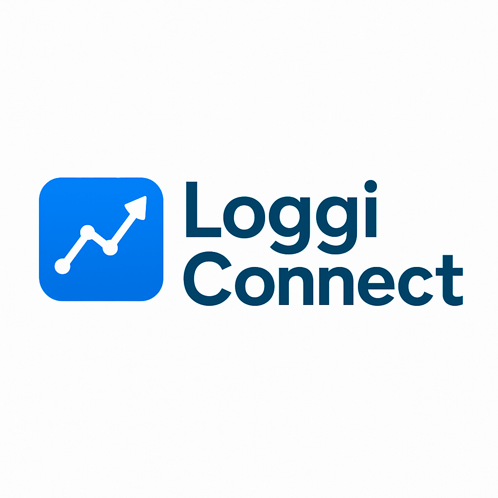

# LogData-Insights

  

Projeto completo de simulação e análise de dados logísticos para a startup LoggiConnect, com ETL em Python e modelo de dados SQL Server
---
🚀 Visão Geral do Projeto

No dinâmico universo da logística, a LoggiConnect se destaca como uma startup inovadora que faz a ponte essencial entre empresas de e-commerce e transportadoras em todo a região Sudeste. Com um ambiente digital que otimiza a gestão logística, o monitoramento de entregas e a otimização de custos, a LoggiConnect lida diariamente com um vasto volume de dados operacionais.

É neste cenário desafiador que o LogData Insights surge como um projeto estratégico. Nosso objetivo principal é demonstrar, de forma prática e aplicada, como transformar dados operacionais brutos em informações estratégicas para o negócio logístico.

Este projeto completo de simulação, análise e visualização de dados foca em:

Modelagem de Dados Robusta: Construindo a fundação no SQL Server para uma gestão de dados eficiente e escalável.

Pipeline de ETL Eficiente: Desenvolvendo processos automatizados em Python para extrair, transformar e carregar dados, garantindo que as informações estejam sempre prontas para análise.

Insights Acionáveis: Capacitando a LoggiConnect a tomar decisões baseadas em dados, otimizar rotas, prever atrasos e aprimorar continuamente a experiência do cliente final.

O LogData Insights reflete a capacidade de construir soluções de dados que não apenas processam informações, mas também geram inteligência de negócio real em um setor tão crucial como a logística.
